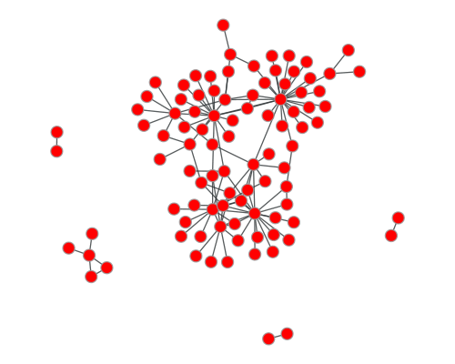

# Visualisation

The population is created based on 3 different methods (preferential/random/small-world). Thereby, the base network/criminal network is preserved; the links between criminals are not modified. Only links to honests and lone actors are created.

    Visualising the preferential attachment

    Visualising the random attachment

    Visualising the small-world attachment

Once the population is created the simulation is run, where nodes interact and modify their state.

During the simulation, attention is paid to the change in the criminal organization. From the population, only the criminal nodes and the link to each other are filtered out, resulting in the following sub-network. Thus, the topological changes of that sub-network are analyzed

---

# How to generate these animations

To generate the different animations, the following commands can be used. Thereby, the data used for the initial criminal network can be changed accordingly

    # To simulate the attachment process using the different methods

    # preferential attachment
    python3 main.py -animate-attachment-process -read-data -attach-meth preferential

    # random attachment
    python3 main.py -animate-attachment-process -read-data -attach-meth random

    # small-world attachment
    python3 main.py -animate-attachment-process -read-data -attach-meth preferential

To generate an animation of the simulation, the following command will do it

    python3 main.py -animate-simulation unfiltered -read-data -attach-meth preferential

To have an animation of only the evolution of the criminal network

    python3 main.py -animate-simulation filtered -read-data -attach-meth preferential
