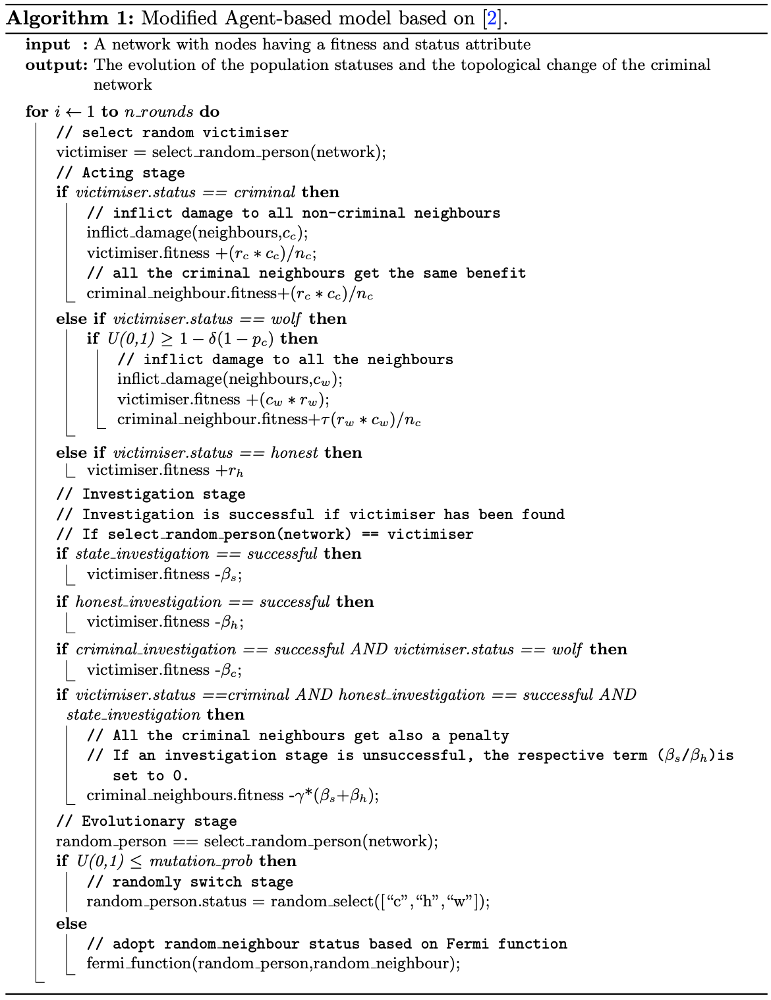

# The Simulation

The simulation is an modified model from the following [paper](https://www.nature.com/articles/s41598-019-46141-8).

    Martinez-Vaquero, L. A., Dolci, V., & Trianni, V. (2019). Evolutionary dynamics of organised crime and terrorist networks. Scientific reports, 9(1), 1-10.

The model has been adopted to a network-explicit configuration.
An mechanism of the model is outlined in the following pseudo-algorithm

